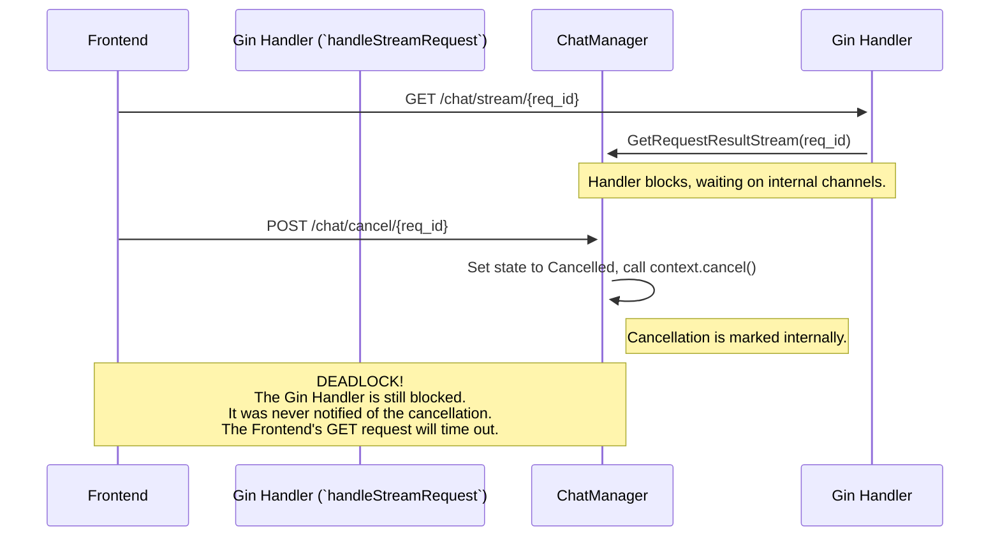
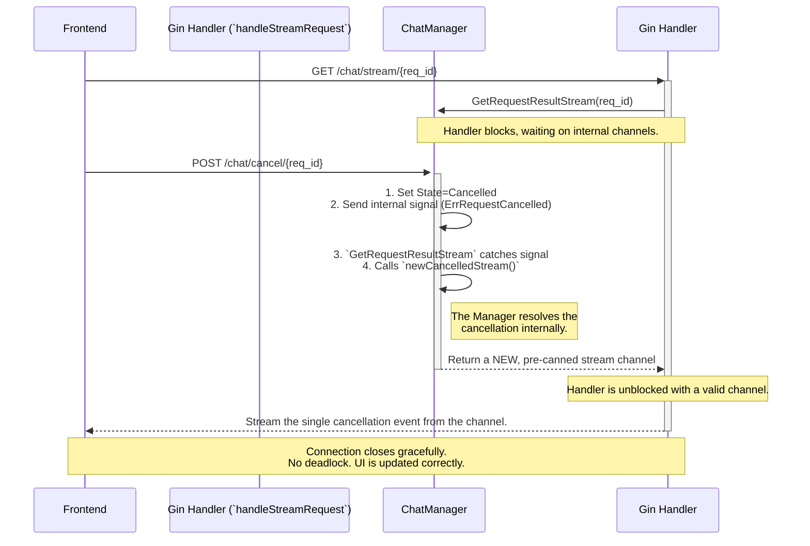

# Architectural Deep Dive: The Manager as "The Wolf"

This document details the architecture for handling real-time request cancellation. The previous design was vulnerable to a deadlock. The current design eliminates it with a precise, encapsulated pattern within the Chatbot Manager, inspired by the cool efficiency of a crime scene cleaner like "The Wolf" from *Pulp Fiction*.

## 1. Context: The Race to Stream

The system is built for real-time interaction. This creates a classic race condition.

1.  **Submission:** Client `POST`s to `/chat/submit`. A request is created and queued.
2.  **Connection:** Client immediately opens an SSE connection to `GET /chat/stream/{request_id}`. The handler for this route blocks, waiting for the Manager to provide a stream channel.
3.  **Work Begins:** A worker picks up the request and starts processing.
4.  **Cancellation:** The user can `POST` to `/chat/cancel/{request_id}` at any moment.

The deadlock happens if the cancellation (4) occurs after the client connects (2) but before the worker has produced a stream (3). The handler is left waiting for a stream that will never arrive—a zombie connection, like a Terminator that's lost its target.

## 2. The Problem: A Deadlock Standoff

The old system created a standoff worthy of a Tarantino film.

-   The `handleStreamRequest` goroutine was blocked, waiting for a channel (`streamHolder.Stream` or `streamHolder.Err`) to receive data.
-   The `CancelStream` function would stop the backend worker, guaranteeing those channels would *never* receive data from the worker.
-   The handler was stuck, the client connection would hang, and the request would eventually time out with a generic network error. It was messy.

### Problematic Flow Diagram

## 3. The Solution: The Manager Handles the Hit

The solution is not a clumsy, two-part fix between the Manager and the Handler. It's an elegant, self-contained strategy entirely within the `Chatbot Manager`. The Manager now handles all cancellation scenarios and provides a consistent, predictable output to the handler. There are two paths to cancellation, and the Manager handles both flawlessly.

**Key Component:** `newCancelledStream()` helper function. This function creates a "ghost stream"—a new channel that delivers a single, pre-formatted cancellation event and then immediately closes. It's the perfect tool for a clean getaway.

### Path A: Pre-emptive Strike (Request Already Cancelled)

This occurs when the `GET /chat/stream` request arrives for a request ID that has *already* been marked as cancelled.

1.  `GetRequestResultStream` is called.
2.  It first checks the request's state: `if streamHolder.State == types.StateCancelled`.
3.  The check is `true`. The target is already down.
4.  The Manager immediately calls `m.newCancelledStream()`.
5.  This returns a *new, valid channel* to the handler that will emit one cancellation event and then close. No deadlock. No error. Just a clean, finished job.

### Path B: The Race Condition (Cancelled During Wait)

This is the classic deadlock scenario. The handler is already blocked inside `GetRequestResultStream`, waiting in the `select` block.

1.  `CancelStream` is called from another goroutine.
2.  It sets the request state to `StateCancelled`.
3.  **The Signal:** It sends `types.ErrRequestCancelled` to the `streamHolder.Err` channel. This is not for the handler; it's an *internal signal* to the waiting `GetRequestResultStream` goroutine.
4.  **The Unblocking:** The `select` block inside `GetRequestResultStream` immediately unblocks, having received the signal on the `Err` channel.
5.  **The Pivot:** Instead of propagating this error up to the handler, it catches it and calls `m.newCancelledStream()`.
6.  Just like in Path A, it returns a clean, valid channel to the handler.

In both scenarios, the `Manager` absorbs the complexity and resolves the situation internally. It never returns a special error to the handler that requires interpretation. It always provides a valid stream channel.

### Solved Flow Diagram

## 4. The Handler's Role: The Getaway Driver

With the Manager acting as the "fixer," the Gin handler (`handleStreamRequest`) becomes the simple getaway driver. Its job is not to think; its job is to drive.

-   It calls `GetRequestResultStream`.
-   It receives a channel. It has no idea if this is a real-time LLM stream or a pre-canned cancellation stream from `newCancelledStream`. **It doesn't care.**
-   It loops, reads events from the channel, and writes them to the client until the channel is closed.

This is a perfect separation of concerns. The handler handles HTTP I/O. The Manager handles business logic and state.

## 5. Conclusion

This architecture resolves the pre-stream cancellation deadlock with precision. By centralizing the cancellation logic within the `Chatbot Manager` and using the "ghost stream" pattern (`newCancelledStream`), we eliminate race conditions and provide a single, reliable interface to the I/O layer. The system is no longer a messy shootout; it's a John Wick headshot. The problem is eliminated cleanly, efficiently, and without collateral damage to the user experience.
