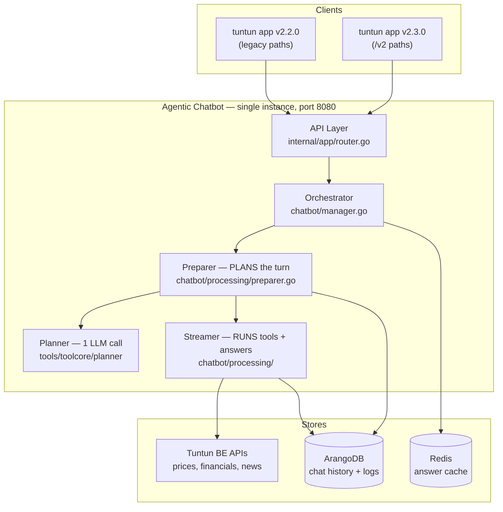
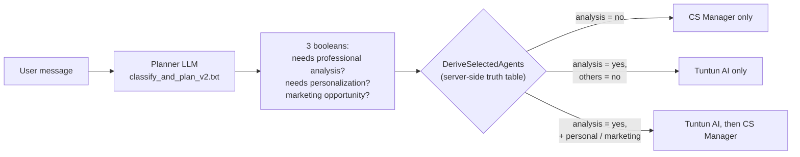
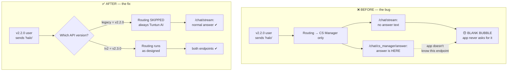

**Audience:** engineering leads
**Last updated:** 2026-08-12
**Live commit:** `ef1e280e` (tag `v2.0.0-build.ef1e`)

---

## 1. The situation in one paragraph

We run **one** chatbot instance serving **two** mobile app versions at the same time:
tuntun app **v2.2.0** (older, still ~86% of traffic) and **v2.3.0** (newer). V2.3.0 introduced a
second AI agent — the **Customer Service Manager** — whose answer is delivered on a *new
endpoint that v2.2.0 does not know about*. On 2026-08-12 this caused v2.2.0 users to receive
**blank answers** on conversational messages. The fix: the backend now detects which API version
a request arrived on and only runs the second agent for clients that can actually receive it.

---

## 2. System map



**Reading it:** every turn is *planned once* (one LLM call decides which tools to run and which
agent answers), then *executed once*. The plan is the contract between the Preparer and the
Streamer.

---

## 3. Two API surfaces, one backend

V2.3.0 changed the response shape of three endpoints. Rather than break v2.2.0, we **added**
`/v2` copies and froze the originals.

| Purpose | v2.2.0 calls (legacy) | v2.3.0 calls | Same handler? |
|---|---|---|---|
| Send a message | `POST /chat/submit` | `POST /v2/chat/submit` | Yes — branches internally |
| Load history | `GET /session/history` | `GET /v2/session/history` | No — separate handler |
| Poll status | `GET /chat/status/{id}` | `GET /v2/chat/status/{id}` | Yes — branches internally |
| **Receive the answer** | `GET /chat/stream/{id}` | `GET /chat/stream/{id}` | **Shared — unchanged** |
| **CS Manager answer** | *does not know it exists* | `GET /chat/cs_manager/answer/{id}` | v2.3.0 only |

The last two rows are the whole story. **Both apps read the main answer from the same
`/chat/stream` endpoint.** Only v2.3.0 knows to also open `/chat/cs_manager/answer`.

### How the backend knows which version it is

A one-line middleware tags the request; nothing else in the system has to guess.

```go
// internal/app/router.go
func markV2(c *gin.Context) {
    c.Set("api_version", "v2")   // only /v2/* routes pass through this
    c.Next()
}
```

Legacy routes skip it, so `api_version` is empty. **Empty = v2.2.0. `"v2"` = v2.3.0.**

---

## 4. Dual-agent routing (the V2.3.0 feature)

During planning, the LLM answers three yes/no questions about the user's message. The **server**
— not the LLM — converts those into the list of agents that will respond.



| Needs analysis | Needs personalization | Marketing | → Agents | Delivered on |
|---|---|---|---|---|
| no | any | any | **CS Manager only** | `/chat/cs_manager/answer` **only** |
| yes | no | no | Tuntun AI only | `/chat/stream` |
| yes | yes *or* marketing | — | Tuntun AI **+** CS Manager | both endpoints |

Row 1 is the dangerous one: **a "CS Manager only" turn streams no answer text on
`/chat/stream` at all.** It sends a single `not_selected` marker and closes.

---

## 5. The incident, and the fix

Chit-chat ("halo", "makasih", "aku takut rugi") scores *needs analysis = no* → **row 1**.



### The gate — one line

The API version is passed from the HTTP layer down to the planner, where it is combined with the
existing feature flag **once**:

```go
// tools/toolcore/planner/planner.go
csManagerAllowed := config.AppSettings.EnableCSManager && apiVersion == "v2"
```

That single boolean drives three things:

1. **The prompt** — for v2.2.0, `classify_and_plan_v2.txt` renders with the entire CS-Manager
   section removed. The LLM is never even asked the routing question.
2. **The decision** — routing is pinned to `[tuntun_ai]`, so "CS Manager only" cannot occur.
3. **A skipped external call** — the user-profile lookup only runs when routing needs it.

Everything downstream (tool execution, streaming, caching, history) reads the *result* of the
decision, so **no other component needed changing.** That is why a production-critical fix
touched only 8 production files — the rest of the change was threading the value down and
updating tests.

### Why the version is passed explicitly, not read from a global

The API version travels as a normal function parameter through
handler → orchestrator → preparer → planner. The alternative (a hidden context value) would
compile fine if a developer forgot to pass it — and silently reintroduce this exact bug. With an
explicit parameter, forgetting it **fails to build**.

This also matches an existing V2.3.0 rule: `/session/history` and `/chat/status` were *already*
version-pinned for the same reason. Routing was simply the one place it had been missed.

---

## 6. Confirmed in production

Measured from production logs, 19 minutes after the 2026-08-12 20:31 WIB deploy:

| Requests from | Turns | CS-Manager routing | Result |
|---|---|---|---|
| v2.2.0 (legacy paths) | 36 | **disabled** | always got an answer |
| v2.3.0 (`/v2` paths) | 6 | **enabled** | 5 correctly routed to CS Manager |

**Zero** "CS Manager only" turns on legacy requests — the failure mode is gone. No panics.
Every turn logs `api_version` and `cs_manager_allowed`, so this stays auditable in Grafana.

Note the traffic mix: **86% of production traffic is still tuntun app v2.2.0.** The bug was
affecting the majority of users, not a small tail.

---

## 7. Things to know

- **Rollback is a plain code revert.** No config, no `.env`, no database migration.
- **This assumes v2.3.0 always uses `/v2/chat/submit`.** Production logs now confirm it does. If
  a future FE build ever falls back to the legacy path, CS Manager goes quiet for it — silently.
  Worth keeping as a rule for the FE team, not just an assumption.
- **The answer cache is shared between both app versions** and does not distinguish them. This is
  safe today because "CS Manager only" turns are never cached, so a v2.2.0 user can never be
  served a CS-authored answer.
- **Long term, this split is temporary.** Once v2.2.0 usage drops far enough, the legacy paths and
  this gate can be retired together.

---

## 8. Where things live

| Component | Path |
|---|---|
| Routes & version tagging | `internal/app/router.go` |
| Submit handler (both versions) | `internal/handlers/chat.go` |
| Orchestrator | `chatbot/manager.go` |
| Planning | `chatbot/processing/preparer.go` → `tools/toolcore/planner/` |
| **The gate** | `tools/toolcore/planner/planner.go`, `routing.go` |
| Tool execution & answering | `chatbot/processing/streamer*.go` |
| Planner prompt | `tools/tooltypes/prompts/classify_and_plan_v2.txt` |
