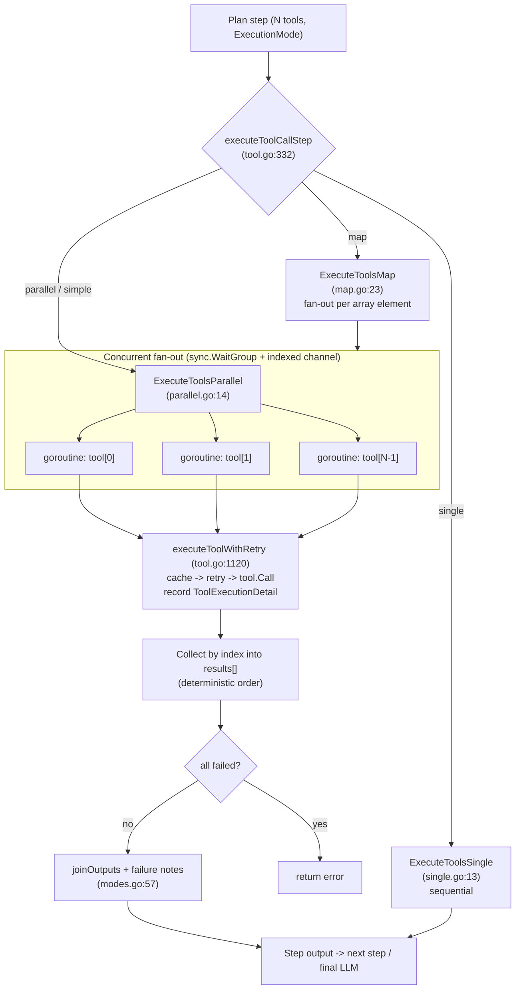

This document describes how the chatbot executes multiple tools concurrently in the
current architecture. It replaces an earlier, informal write-up that described a
monolithic `caller.go` being upgraded from sequential to concurrent execution. That
framing is no longer accurate: there is no monolithic caller. Concurrent tool
execution is now a property of the **pipeline execution subsystem**, which is one of
the three custom orchestration subsystems (`planner` / `pipeline` / `executor`)
documented in
[Why We Built Our Own Pipeline Instead of Adopting an Off-the-Shelf Agent Framework](../../architectures/custom_pipeline_vs_frameworks/).

The concurrency primitives described here (goroutines, `sync.WaitGroup`, buffered
indexed result channels, deterministic reassembly, per-tool timeouts) still exist in
the code. What changed is *where* they live and *how* they are wired: they are no
longer a single function that a caller invokes over an LLM's raw tool-call list.
Instead they are distributed across the pipeline's execution modes.

---

## 1. Where Concurrent Execution Happens

The plan-and-execute pattern means one LLM call (`ClassifyAndPlan`) emits a full
execution plan up front. A plan is a sequence of steps; each step declares an
`ExecutionMode`. When a step contains more than one tool and the mode allows it, the
tools in that step run concurrently.

Routing by execution mode lives in
`tools/toolcore/pipeline/execution/tool.go:332` (`executeToolCallStep`):

- `"single"` → `ExecuteToolsSingle` (`single.go:13`) — sequential, one tool after another.
- `"parallel"` → `ExecuteToolsParallel` (`parallel.go:14`) — concurrent fan-out.
- `"simple"` → treated as an alias for `"parallel"` (the LLM sometimes emits this label).
- `"map"` → `ExecuteToolsMap` (`map.go:23`) — one iteration per array element, with
  each iteration itself running its tools concurrently.

The two subsystem-level helpers `tools/toolcore/pipeline/types.go:210`
(`ExecuteToolsParallel`) and `types.go:221` (`ExecuteToolsMap`) are thin re-exports of
the `execution` package functions.

---

## 2. Parallel Fan-Out: `ExecuteToolsParallel`

`tools/toolcore/pipeline/execution/parallel.go:14` is the core concurrent path. Given
a slice of `ToolSpec` values, it launches one goroutine per tool and collects results.

### 2.1 Concurrency primitives

The function uses a `sync.WaitGroup` and a buffered, index-tagged result channel
(`parallel.go:30`):

```go
resultsChan := make(chan struct {
    index  int
    output string
    err    error
}, numTools+1)
```

Each tool is launched in its own goroutine (`parallel.go:38`), and a separate closer
goroutine waits on the `WaitGroup` and closes the channel once all workers report
(`parallel.go:58`):

```go
go func() {
    wg.Wait()
    close(resultsChan)
}()
```

The `+1` buffer slot is deliberate headroom (annotated `P0-TC-A001`) against goroutine
scheduling variation; the channel is drained by ranging over it until close.

### 2.2 Latency characteristics

Sequential execution (`ExecuteToolsSingle`) costs the sum of the individual tool
latencies. If three tools take 3s, 1s, and 2s, the step takes ~6s. Parallel execution
costs approximately the latency of the slowest tool — ~3s for the same three tools.
Because the tools in a step are overwhelmingly I/O-bound (external HTTP APIs, internal
LLM calls), this fan-out is the dominant latency win of the engine.

### 2.3 Deterministic result ordering

Results arrive on the channel in nondeterministic completion order, but each carries
its original slice index. They are written back into a pre-sized slice at that index
(`parallel.go:82`):

```go
results := make([]string, numTools)
// ...
results[result.index] = result.output
```

This guarantees the assembled output preserves the order the planner declared,
regardless of which tool finished first. Downstream, `joinOutputs`
(`execution/modes.go:57`) additionally sorts citation entries by source number so the
final LLM prompt is stable across runs.

### 2.4 Partial-failure resilience

The parallel path does not fail fast. It waits for every tool to complete and
separates successes from failures (annotated `P1-PP-A064`):

- If **all** tools fail, it returns an error (`parallel.go:88`).
- If **some** tools fail, it returns the successful outputs and appends a human-readable
  note listing the failed tools so the final LLM can tell the user which data is
  missing (`parallel.go:98`).

A single failing tool therefore degrades the answer rather than aborting the whole
step.

---

## 3. Per-Tool Execution: Retry, Cache, and Telemetry

Every goroutine in the fan-out calls the same `ExecuteToolFunc` closure
(`tool.go:550`, `createExecuteToolFunc`), which delegates to
`PipelineExecutor.executeToolWithRetry` (`tool.go:1120`). Per tool, this function:

1. Validates and prepares the tool and its arguments (`validateAndPrepareTool`,
   `tool.go:1494`).
2. Checks the tool-execution cache first (`checkToolCache`, `tool.go:558`); a hit skips
   execution entirely and is recorded with `IsCacheHit: true`.
3. Wraps the actual `tool.Call` in `pipelineretry.ExecuteToolWithRetry`
   (`tools/toolcore/pipeline/retrydir/retry.go:178`), which retries transient failures
   up to `config.AppSettings.DefaultRetryLimit` (default 3, `config/config.go:135`).
4. Records a structured `ToolExecutionDetail` on success or failure
   (`recordSuccessfulExecution` `tool.go:662`, `recordFailedExecution` `tool.go:624`).

### 3.1 Structured per-tool telemetry

Each execution produces a `pipelinetypes.ToolExecutionDetail`
(`tools/toolcore/pipeline/types/metrics.go:119`) rather than a bare output string. Its
fields include:

- `ToolName`, `InputArgs`, `ToolOutput`, `NumTokens`
- `DurationSec`, `Timestamp` — timing for the individual call
- `Error`, `LLMErrorDetail` — the failure message and, for tools whose internal LLM
  call failed, the raw provider error body
- `RetryAttempts`, `IsCacheHit` — execution provenance
- `LLMCalls` — nested LLM-call metrics for tools that call an LLM internally
- `APIAddress` / `APIInput` / `APIOutput` / `ExternalAPIs` — external API I/O captured
  for debugging (`P1-TU-API-LOGGER`)
- `ExtractedStockCodes` / `ExtractedRankMap` / `ExtractedSelectionTypeMap` — domain
  attribution extracted from the tool output

These details accumulate on the enclosing `StepExecutionMetrics`
(`metrics.go:172`, field `ToolExecutions`), which is what makes it possible to identify
slow or error-prone tools after the fact instead of only knowing "the step failed."

---

## 4. Map-Mode Nested Parallelism

`ExecuteToolsMap` runs a step's tools once per element of a resolved array (for
example, one broker-summary lookup per stock code produced by an upstream step). Within
each iteration, the tools still run concurrently: `map_iteration.go:72` defines a local
`executeToolsInParallel` that mirrors the fan-out pattern — a `sync.WaitGroup`, a
buffered channel of `{toolName, output, err}` (`map_iteration.go:83`), and a
closer goroutine (`map_iteration.go:108`). Results are keyed by tool name into
`toolResults` / `toolErrors` maps and folded into a structured `MapIterationOutput`.
Like the top-level parallel path, it handles partial iteration failure gracefully
rather than aborting.

---

## 5. Cancellation and Timeouts

The parallel path passes the shared, request-scoped `context.Context` to every
goroutine. Cancellation therefore fans out: if the client disconnects or the request
deadline elapses, the cancelled context propagates to all in-flight tool calls, and any
tool that honors the context aborts its I/O.

A dedicated per-tool timeout is provided by the reusable concurrency helper described in
Section 6, which wraps each tool call in `context.WithTimeout(ctx,
config.AppSettings.ToolTimeout)` (default 30s, `config/config.go:100`). Note that the
live pipeline parallel path (`ExecuteToolsParallel`) does **not** itself install a
separate per-tool deadline on top of the request context; it relies on the shared
context, on the retry layer, and on individual tools' own timeouts. This is a
correction to the earlier document, which implied every tool call was universally
wrapped in a 30-second timeout.

---

## 6. The Reusable Concurrency Helper (`toolutils`)

`tools/toolutils/callerutils.go:81` defines `ExecuteToolsInParallel` (and its
request-ID-aware variant `ExecuteToolsInParallelWithRequestID`, `callerutils.go:86`).
This is a self-contained concurrency primitive that operates on the raw
`[]llms.ToolCall` shape rather than on planner `ToolSpec`s. It encapsulates the same
pattern the pipeline uses, and it is where the earlier document's symbol names still
live:

- It builds an index-tagged result channel `struct { index int; result
  ToolExecutionResult }` (`callerutils.go:91`) and a `sync.WaitGroup`.
- It launches `executeToolAsync` (`callerutils.go:113`) per tool.
- `executeToolAsync` wraps each call in `context.WithTimeout(ctx,
  config.AppSettings.ToolTimeout)` (`callerutils.go:149`), giving each tool an
  independent deadline.
- It reassembles results into a slice by index (`callerutils.go:106`), preserving order.

Each execution is captured in a `tooltypes.ToolExecutionResult`
(`tools/tooltypes/caller.go:51`) with `ToolName`, `ToolArgs`, `Observation`, `Error`,
`StartTime`, `EndTime`, and `Duration`. `ConvertToolResultsToMetadata`
(`callerutils.go:182`) converts those results into the persisted
`types.ToolExecutionMetadata` records.

This helper is the direct descendant of the pattern the old document praised. The
production request path today runs through the pipeline execution modes in Sections
2–4; `ToolExecutionResult` and the per-tool `ToolTimeout` remain the reference
implementation of the timeout/telemetry contract that the pipeline path expresses
through `ToolExecutionDetail` and its own metrics instead.

---

## 7. Execution Flow Diagram



---

## 8. Summary of Design Guarantees

| Concern | Mechanism | Location |
| --- | --- | --- |
| Parallelism | one goroutine per tool, `sync.WaitGroup` | `parallel.go:36`, `map_iteration.go:81` |
| Deterministic ordering | index-tagged channel written into a pre-sized slice | `parallel.go:30`, `parallel.go:82` |
| Partial-failure tolerance | wait for all, return successes + failure notes | `parallel.go:88`, `parallel.go:98` |
| Retry | `ExecuteToolWithRetry` up to `DefaultRetryLimit` | `retrydir/retry.go:178`, `config/config.go:135` |
| Caching | tool-execution cache checked before running | `tool.go:558` |
| Per-tool telemetry | `ToolExecutionDetail` on every call | `metrics.go:119`, `tool.go:662` |
| Cancellation | shared request context fans out to all goroutines | `parallel.go:44` |
| Per-tool timeout (reusable helper) | `context.WithTimeout(ctx, ToolTimeout)` | `callerutils.go:149`, `config/config.go:100` |
