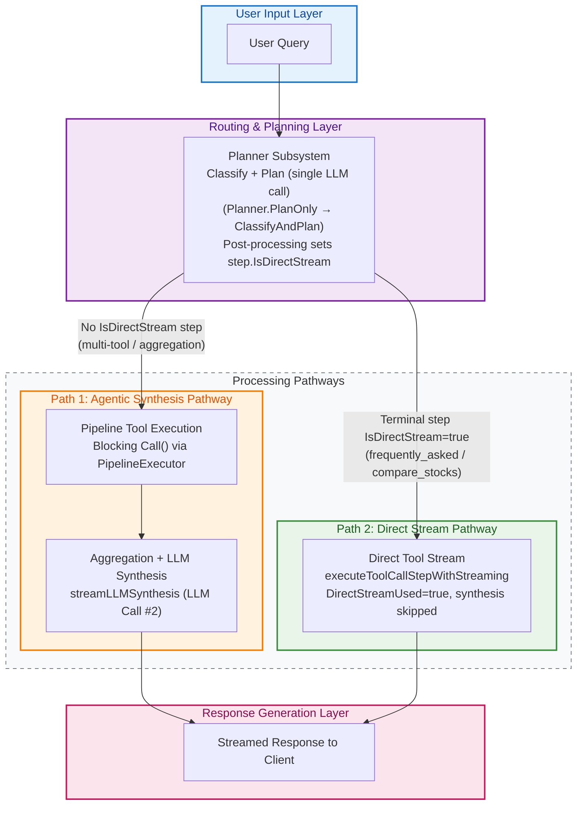

## 1. Core Principle: Cost- and Latency-Aware Routing

The system does not apply a single, uniform processing strategy to every request. Doing so would be inefficient and expensive. Instead, it uses a dual-path architecture that segregates requests by complexity and routes each one down the cheapest path capable of answering it correctly.

The architecture exposes two distinct processing pathways, selected dynamically during planning:

1.  **The Agentic Synthesis Path:** For complex, multi-faceted queries that require fusing data from several sources. This is the reasoning path. It is capable but comparatively slow and expensive.
2.  **The Direct Stream Path:** For queries that a single authoritative source (such as a RAG knowledge base) can answer directly. This is the retrieval path. It is fast, cheap, and high-fidelity.

A single combined classification-and-planning LLM call inspects each query and produces an execution plan that determines which path is taken. Simple factual questions are answered by streaming a single tool's output directly to the client; complex questions receive the full analytical pipeline with a final synthesis call.

### Planning entry point

The planner subsystem (`tools/toolcore/planner/`) owns routing. The preparer holds a `types.PlanningInterface` and invokes `Planner.PlanOnly` (`tools/toolcore/planner/planner.go`), which calls `ClassifyAndPlan` (same file). `ClassifyAndPlan` issues **one** LLM call that both classifies the execution mode (`simple` vs `pipeline`) and selects tools, then parses the response into a `pipeline.ExecutionPlan` and applies post-processing via `EnforceToolDependencyRules` (`tools/toolcore/planner/postprocess.go`). The concrete planner is wired in `chatbot/manager_core.go` through `toolcore_planner.NewPlanner()` and `preparer.SetPlanningInterface(planner)`.

> **Note on a retired symbol.** Earlier revisions of this document attributed routing to `toolcore.SelectAndPrepareTools`. That function no longer exists. Planning and tool selection are now the responsibility of the `planner` subsystem, entered through `Planner.PlanOnly` → `ClassifyAndPlan`.

## 2. The Processing Pathways

### Path 1: The Agentic Synthesis Path

This is the multi-step path for queries that require reasoning over data gathered from several tools.

**Use Case:** "Compare BBCA's profitability ratios to its historical stock performance over the last year and summarize any relevant news."

**Execution Flow:**

1.  **Planning (LLM Call #1):** `ClassifyAndPlan` produces an `ExecutionPlan`. For a multi-tool query this is either `simple` mode (tools run concurrently as a single step) or `pipeline` mode (ordered, dependent steps), typically terminating in an aggregation step. This is the first LLM call.
2.  **Tool Execution:** The streamer converts the plan with `ExecutionPlan.ToPipelinePlan()` and hands it to `PipelineExecutor.ExecutePipeline` (`tools/toolcore/pipeline/`). Each tool's blocking `Call` executor runs to gather its portion of the data — raw JSON, news text, and so on. Simple mode executes as one parallel step; pipeline mode executes steps in order.
3.  **Synthesis (LLM Call #2):** Because no step set `IsDirectStream`, the pipeline metric `DirectStreamUsed` remains `false`. The streamer therefore proceeds to `streamLLMSynthesis` (`chatbot/processing/streamer_strategies.go`), which consolidates the aggregated tool output into a prompt and streams a second, synthesizing LLM call to the client. This is the second, more expensive LLM call.

**Operational Characteristics:**

*   **Capability:** Handles intricate, multi-domain questions that require reasoning and data fusion.
*   **Latency:** High. Total time is approximately `LLM_Call_1 + max(Tool_Execution_Time) + LLM_Call_2`.
*   **Cost:** High. Two LLM calls; the synthesis call can be token-heavy.
*   **Fidelity:** The final answer is an LLM *interpretation* of the tool data, so there is a non-zero risk of misinterpretation.

### Path 2: The Direct Stream Path

This is the low-latency path. It is engaged when the plan's final step is flagged `IsDirectStream` and streams a single tool's output straight to the client, skipping the synthesis call.

**Use Case:** "How do I register on the Tuntun application?"

**Execution Flow:**

1.  **Planning (LLM Call #1):** `ClassifyAndPlan` selects a single tool. Post-processing then decides eligibility for direct streaming (see below) and, when eligible, rewrites the plan into a one-step pipeline whose step carries `IsDirectStream: true`. The LLM is not asked to make this decision; it is enforced deterministically in code.
2.  **Streaming Execution (Synthesis Bypassed):** The streamer detects `ExecutionPlan.HasDirectStreamStep()` and installs a `stringToEventAdapter` so the pipeline can emit tokens to the client. In `PipelineExecutor.executeStepByType` (`tools/toolcore/pipeline/execution/step.go`), the guard `isLastStep && step.IsDirectStream && streamChan != nil` sets `parentMetrics.DirectStreamUsed = true` and calls `executeToolCallStepWithStreaming` (`tools/toolcore/pipeline/execution/tool.go`). That function invokes the tool's streaming executor, which pipes the RAG service response to the client token by token. After the pipeline returns, the streamer sees `metrics.DirectStreamUsed == true` and calls `finalizeWithoutSynthesis`, returning **before** `streamLLMSynthesis` — the second LLM call is never made.

**Operational Characteristics:**

*   **Latency:** Low. Reduced to a single planning LLM call plus the time-to-first-token of the RAG service.
*   **Cost:** Minimal. Only the planning call is paid for; high-volume FAQ traffic becomes inexpensive.
*   **Fidelity:** High. The client receives the knowledge base's answer verbatim; the LLM never rewrites the answer content, so there is no interpretation risk on the answer itself.

### How the direct-stream decision is made

The decision is deterministic and made entirely in planner post-processing. There are **two distinct mechanisms** — one for natural-answer tools, one for the `compare_stocks` marker — and they deliberately do **not** share an eligibility test.

1.  **Natural-answer tools (`frequently_asked`).** Eligibility is governed *solely* by the `NATURAL_ANSWER_TOOLS` environment variable (`config.AppSettings.NaturalAnswerTools`, default `frequently_asked`). `EnforceFrequentlyAskedDirectStream` (`tools/toolcore/planner/postprocess.go`) converts a `simple`-mode single-tool `frequently_asked` plan into a **one-step** `pipeline` with `IsDirectStream: true` — but only if the tool is listed in `NATURAL_ANSWER_TOOLS`. This is the *only* path by which a natural-answer tool direct-streams: it originates from `simple` mode and always yields a single-step pipeline. A natural-answer tool appearing inside a genuine multi-step pipeline is **never** direct-streamed. The single eligibility predicate is `pipeline.IsDirectStreamEligible` (`tools/toolcore/pipeline/helpers.go`), which returns true iff the step's one tool is a member of `NATURAL_ANSWER_TOOLS`; it is used for **validation only**, never to force the flag.

2.  **The `compare_stocks` marker.** `compare_stocks` is not a registered executable tool, and its direct-streaming is *intrinsic*, not optional — it is a reserved terminal synthesis marker routed by the pipeline to the injected `ComparisonSynthesizer` (`chatbot/processing/comparison`). It is recognized by **name** (`consts.ToolCompareStocks`), independent of `NATURAL_ANSWER_TOOLS` and of `pipeline.IsDirectStreamEligible`. `correction.EnforceTransformAndDirectStreamRules` (`tools/toolcore/planner/correction/transform.go`) auto-sets `IsDirectStream: true` on the terminal `compare_stocks` marker step so the streamer allocates a channel (`ExecutionPlan.HasDirectStreamStep()`); the executor then routes the marker to the synthesizer by name.

Validation enforces the invariant that a step may carry `IsDirectStream: true` **only if** it is the `compare_stocks` marker **or** a single-step `NATURAL_ANSWER_TOOLS` pipeline; any other direct-stream step is rejected and replaced by aggregation (`EnforceTransformAndDirectStreamRules` and `ValidateFirstStep` in `tools/toolcore/planner/validation/plan.go`).

> **History:** earlier revisions used a single hardcoded predicate `validation.IsDirectStreamEligible` (`compare_stocks || frequently_asked`) in a now-deleted `tools/toolcore/planner/validation/stream.go`. Because it was applied uniformly, a pipeline whose terminal step happened to be `frequently_asked` could be force-converted to direct-stream. Eligibility is now **config-only** for natural-answer tools and **name-based** for the `compare_stocks` marker, which closes that gap.

## 3. The Dual-Mode Tool: One Tool, Two Executors

The flexibility of this architecture depends on tools that can serve either path. A `DynamicTool` (`tools/toolcore/dynamic.go`) can expose both a blocking and a streaming executor:

1.  **`Executor` (invoked via `Call`):** A blocking function that returns a complete string. Used when the tool participates in the **Agentic Synthesis Path (Path 1)**, where its output is aggregated with other tools' outputs before synthesis.
2.  **`StreamExecutor` (invoked via `Stream`):** A streaming function that writes `types.StreamEvent`s to a channel. Used when the tool is the sole step of a **Direct Stream Path (Path 2)** plan.

The `frequently_asked` RAG tool, registered in `tools/toolcore/definitions.go`, implements both:

*   its `Executor` calls `toolnonbe.TencentFrequentlyAsked` (blocking, returns marshaled JSON), and
*   its `StreamExecutor` calls `toolnonbe.StreamTencentFrequentlyAsked` (`tools/toolnonbe/ragtencent.go`), which consumes the Tencent Cloud Dialogue SSE API and forwards tokens to the stream channel.

This dual implementation lets the same authoritative RAG knowledge base be used in whichever mode the query context requires.

## 4. Architectural Resilience

Resilience in the current architecture is layered, and the layers are precise about what they do:

*   **Configuration-gated routing (the true "fall back to synthesis").** Whether `frequently_asked` streams directly is a plan-time decision governed by `NATURAL_ANSWER_TOOLS`. If the tool is not configured for natural-answer streaming, `EnforceFrequentlyAskedDirectStream` leaves the plan in the standard path, where the blocking `Call` executor runs and the answer is produced by the synthesis call. Disabling direct streaming is a configuration change, not a code change.
*   **Adapter fallback for non-streaming tools.** If a step is marked direct-stream but the resolved tool does not implement the `StreamExecutor` interface, `executeToolCallStepWithStreaming` wraps it with `NewToolStreamAdapter` (`tools/toolcore/pipeline/streamingdir/adapter.go`), which drives the tool's blocking `Call` and adapts its output onto the stream channel.
*   **Retry on the streaming step.** The streaming executor runs inside `ExecuteToolWithRetry`, so transient failures are retried with the configured retry limit.
*   **Error surfacing.** If retries are exhausted, the error propagates out of `ExecutePipeline` and is handled by `handleError` in the streamer, which emits a terminal `StreamEventError`. Note that a direct-stream failure is **not** silently re-run through LLM synthesis; the earlier claim of an automatic stream-failure-to-synthesis fallback does not match the current unified pipeline.

## 5. Visual Architecture

This diagram shows the planning decision point and the two pathways.

## 6. Side-by-Side Comparison

| Feature               | Path 1: Agentic Synthesis Path                                                | Path 2: Direct Stream Path                                                            |
| :-------------------- | :----------------------------------------------------------------------------- | :------------------------------------------------------------------------------------ |
| **Core Task**         | Analysis, reasoning, data fusion                                               | Factual recall, direct retrieval                                                      |
| **Decision Flag**     | No step sets `IsDirectStream`; `DirectStreamUsed` stays `false`                | Terminal step has `IsDirectStream: true` (`HasDirectStreamStep()` true)               |
| **Latency**           | High (planning call + tool execution + synthesis call)                         | **Low** (planning call + RAG stream TTFT)                                             |
| **API Cost**          | High (2 LLM calls)                                                             | **Low** (1 planning LLM call)                                                          |
| **Data Fidelity**     | LLM-interpreted; risk of misinterpretation                                    | **High.** Streamed from the source of truth; no answer-content interpretation         |
| **Tool Executor Used**| Blocking `Call` for all selected tools, then LLM synthesis                     | Streaming `Stream` (`StreamExecutor`) for the single terminal tool                    |
| **Completion Path**   | `streamLLMSynthesis`                                                           | `finalizeWithoutSynthesis`                                                             |
| **Best Use Case**     | "What should I make of this data?"                                             | "What is the answer to this FAQ?"                                                     |

## 7. Conclusion

The dual-path architecture balances capability against cost and latency. Complex, reasoning-heavy queries receive the full pipeline with a synthesizing LLM call; direct-answer queries backed by an authoritative source are streamed straight to the client, bypassing the second LLM call entirely. The choice is made deterministically during planning — by mode classification, tool eligibility, and the `NATURAL_ANSWER_TOOLS` configuration — so the system consistently applies the appropriate amount of computation to each request.
