### **System Architecture Overview**

#### **I. Executive Summary**

This document outlines the architecture of a high-throughput, asynchronous Large Language Model (LLM) chatbot system. The core design is a decoupled, two-stage processing pipeline engineered to maximize resource utilization, ensure system stability under load, and maintain a responsive user experience. The system comprises three primary components: a web gateway for API and client interaction, a sophisticated core processing engine for managing the request lifecycle, and a dynamic client-side interface for user interaction and real-time data rendering. This architecture explicitly separates inexpensive preparation tasks from resource-intensive LLM generation, enabling concurrent handling of numerous requests while strictly governing access to the LLM.

---

#### **II. Component Breakdown**

##### **A. Gateway & Web Layer (`main.go`)**

The `main.go` file serves as the system's entry point and primary interface to the outside world. It is not merely a server; it is the gatekeeper.

*   **Responsibilities:**
    *   **System Initialization:** Orchestrates the startup sequence, ensuring all dependencies (logging, configuration, databases, LLM services) are initialized in the correct order before instantiating the core `chatbot.Manager`. Failure at any step is fatal.
    *   **API Routing (Gin):** Establishes all HTTP endpoints. It intelligently segregates public endpoints (e.g., `/chat/stream/:request_id` for Server-Sent Events) from protected endpoints (`/chat/*`) which require API key authentication via middleware.
    *   **Request Handling:** Contains the HTTP handler functions that act as a liaison between raw network requests and the core engine. These handlers are responsible for request validation, data binding, and invoking the appropriate methods on the `chatbot.Manager`. They are the bouncers at the club door, checking IDs before letting anyone into the main room.

##### **B. Core Processing Engine (`chatbot/manager.go`, `chatbot/preparer.go`, `chatbot/streamer.go`)**

This is the system's engine room and central nervous system, architected as a non-blocking pipeline. The `Manager` is the director, the `Preparer` is the logistics officer, and the `Streamer` is the special operations unit. It's the Nick Fury of this operation, assembling the team but not throwing every punch.

*   **`Manager`:** The central orchestrator.
    *   **Request Ingestion:** The `SubmitRequest` function is the sole entry point from the API. It generates a unique request identifier, establishes a state-tracking structure (`types.RequestStream`), and enqueues the request into the initial processing queue (`requestQueue`).
    *   **State Management:** Maintains a master map of all `activeRequests`, tracking their state (`Queued`, `Processing`, `Cancelled`). This is the system's single source of truth for in-flight operations.
    *   **Worker Pool Coordination:** Spawns and manages the goroutine pools for both the preparation and streaming stages, using dedicated queues (`requestQueue`, `preparedQueue`) to pass work between them.
    *   **Lifecycle and Cleanup:** Implements the `CancelStream` logic to gracefully terminate operations via `context` cancellation. A `janitor` goroutine runs periodically to purge stale or timed-out requests, preventing memory leaks. It's The Wolf from *Pulp Fiction*, cleaning up messy situations.

*   **`Preparer` & The Preparation Pipeline (Stage 1):**
    *   **Purpose:** To execute all computationally inexpensive, non-LLM tasks required before final generation. This stage is designed for high concurrency.
    *   **Resource Governor:** A semaphore (`prepareSemaphore`) limits the number of concurrent preparation workers, preventing CPU saturation from an influx of requests.
    *   **Key Operations:**
        1.  **History Formatting:** Fetches and formats previous conversation turns.
        2.  **Cache Interrogation (`singleflight` & Redis):** Checks a Redis cache for a pre-existing answer to an identical query. It uses a `singleflight` group to ensure that multiple identical, concurrent requests only trigger one cache check and one preparation process. The first request does the work; the others get the result. This is not the droid they're looking for... it's the *same* droid.
        3.  **Tool Selection & Pre-computation:** Analyzes the query to determine if specialized tools are needed.
        4.  **Prompt Assembly:** Constructs the final prompt payload for the LLM.
    *   **Output:** A `types.PreparedRequestData` struct—an intermediate artifact containing all necessary data—is pushed to the `preparedQueue`.

*   **`Streamer` & The LLM Streaming Pipeline (Stage 2):**
    *   **Purpose:** To manage the resource-intensive, final LLM generation phase. This stage has low concurrency to protect the LLM service from overload.
    *   **Resource Governor:** A separate, more restrictive semaphore (`llmStreamSemaphore`) strictly limits the number of concurrent LLM streaming calls. This is the primary bottleneck by design. You shall not pass... unless there's a free slot.
    *   **Key Operations:**
        1.  **Execute Generation:** If no cached response exists, it initiates the streaming call to the LLM service or a direct tool stream.
        2.  **Real-time Event Generation:** As data (tokens, info, errors) arrives from the LLM or tool, it is wrapped in a `tooltypes.StreamEvent` and pushed into the client-facing channel.
        3.  **Response Caching:** Upon successful generation, it populates the Redis cache (unless the query involved time-sensitive tools).
        4.  **Logging:** Persists the final transaction record to the database (`ArangoDB`).

##### **C. Client-Side Interface (`frontend/app.js`)**

The `ChatApp` class within `app.js` encapsulates all client-side logic. It is a stateful application responsible for interacting with the backend API and rendering a dynamic user experience.

*   **Responsibilities:**
    *   **API Communication:** Manages all HTTP requests to the backend, including the initial `POST /chat/submit` and subsequent `POST /chat/cancel/:request_id` or reaction updates.
    *   **Real-time Data Handling (`EventSource`):** Upon receiving a `request_id`, it establishes a persistent Server-Sent Events (`EventSource`) connection to the `/chat/stream/:request_id` endpoint. This is the primary mechanism for receiving the real-time response from the server.
    *   **Incremental Rendering:** Listens for `message` events on the `EventSource` stream. Each event payload is a JSON-encoded `StreamEvent`. It parses these events and incrementally renders the `token` payloads as markdown into the DOM, providing a "live typing" effect.
    *   **State Management:** Manages the UI state, toggling the input field's disabled status and switching the send button's function between "Send" and "Stop" based on whether a request is in flight.

---

#### **III. System Workflow & Data Flow**

The following sequence diagram describes the end-to-end data flow with detailed terminology.

```mermaid
flowchart TB
    %% Client Layer
    Client["🖥️ Client Interface<br/><i>frontend/app.js</i><br/>ChatApp Class"]
    
    %% Gateway Layer
    subgraph Gateway ["🌐 Gateway Layer"]
        direction TB
        APIGateway["HTTP Gateway<br/><i>main.go</i><br/>• Authentication<br/>• Request Validation<br/>• Response Streaming"]
    end
    
    %% Core Processing Engine
    subgraph CoreEngine ["⚙️ Core Processing Engine"]
        direction TB
        
        subgraph RequestFlow ["Request Flow Pipeline"]
            direction LR
            RequestQueue[("📥 Request<br/>Queue")]
            PreparedQueue[("📦 Prepared<br/>Queue")]
        end
        
        subgraph WorkerPools ["Worker Pool Architecture"]
            direction TB
            PrepPool["🔧 Preparation Pool<br/><i>chatbot/preparer.go</i><br/>• History Formatting<br/>• Cache Lookup<br/>• Tool Selection<br/>• Prompt Assembly<br/><br/>Semaphore: High Concurrency"]
            StreamPool["🚀 Streaming Pool<br/><i>chatbot/streamer.go</i><br/>• LLM Generation<br/>• Event Streaming<br/>• Response Caching<br/>• Transaction Logging<br/><br/>Semaphore: Controlled Access"]
        end
        
        Manager["🎯 Manager<br/><i>chatbot/manager.go</i><br/>• Request Orchestration<br/>• State Management<br/>• Lifecycle Control<br/>• Resource Coordination"]
    end
    
    %% External Services
    subgraph ExternalServices ["🔌 External Services"]
        direction TB
        LLM["🤖 LLM Service<br/>Token Generation"]
        Redis["⚡ Redis Cache<br/>Response Storage"]
        ArangoDB["🗄️ ArangoDB<br/>Transaction Logs"]
    end
    
    %% Flow Connections
    Client ---|"1. POST /chat/submit<br/>Query + Context"| APIGateway
    APIGateway ---|"2. manager.SubmitRequest()<br/>Generate request_id"| Manager
    Manager ---|"3. Enqueue Request"| RequestQueue
    RequestQueue ---|"4a. Dequeue & Process"| PrepPool
    PrepPool ---|"4b. Cache Check & Tools"| Redis
    PrepPool ---|"5. Enqueue Prepared Data"| PreparedQueue
    PreparedQueue ---|"6. Dequeue & Stream"| StreamPool
    StreamPool ---|"7a. Generate Response"| LLM
    StreamPool ---|"7b. Cache Result"| Redis
    StreamPool ---|"7c. Log Transaction"| ArangoDB
    StreamPool ---|"8. Stream Events"| Manager
    Manager ---|"9. Relay Events"| APIGateway
    APIGateway ---|"10. SSE /chat/stream/:id<br/>Real-time Streaming"| Client
    
    %% Real-time Connection
    Client -.-|"EventSource Connection<br/>Persistent Stream"| APIGateway
    
    %% Styling
    classDef clientStyle fill:#e3f2fd,stroke:#1976d2,stroke-width:2px,color:#000
    classDef gatewayStyle fill:#f3e5f5,stroke:#7b1fa2,stroke-width:2px,color:#000
    classDef managerStyle fill:#fff3e0,stroke:#f57c00,stroke-width:2px,color:#000
    classDef prepStyle fill:#e8f5e8,stroke:#388e3c,stroke-width:2px,color:#000
    classDef streamStyle fill:#fff8e1,stroke:#fbc02d,stroke-width:2px,color:#000
    classDef queueStyle fill:#fce4ec,stroke:#c2185b,stroke-width:2px,color:#000
    classDef serviceStyle fill:#f1f8e9,stroke:#689f38,stroke-width:2px,color:#000
    
    class Client clientStyle
    class APIGateway gatewayStyle
    class Manager managerStyle
    class PrepPool prepStyle
    class StreamPool streamStyle
    class RequestQueue,PreparedQueue queueStyle
    class LLM,Redis,ArangoDB serviceStyle
```

1.  The **Client** submits a user query via a `POST` request to `/chat/submit`.
2.  The **Gateway** handler receives the request, authenticates it, and invokes `chatbot.Manager.SubmitRequest`.
3.  The **Manager** enqueues the request arguments into `requestQueue`. The client receives a `request_id` and immediately opens an `EventSource` connection.
4.  A worker from the **Preparation Pool** dequeues the request. It performs history formatting, cache checks, and tool processing, potentially interacting with Redis.
5.  The worker produces a `PreparedRequestData` payload and enqueues it into `preparedQueue`.
6.  A worker from the **Streaming Pool** dequeues the prepared payload, having acquired a slot from its restrictive semaphore.
7.  The worker executes the final generation logic, either by streaming from the **LLM** or a direct tool stream.
8.  As data arrives, the worker wraps it in `StreamEvent` objects and pushes them into the channel associated with the `request_id`.
9.  The **Gateway**'s `handleStreamRequest` handler, which holds the open `EventSource` connection, receives these events.
10. The events are serialized to JSON and written to the HTTP response stream, which the **Client** receives and renders in real-time.

---

#### **IV. Architectural Design Rationale**

The two-stage architecture is a deliberate design choice, not an accident. It addresses fundamental challenges in building scalable AI systems.

*   **Decoupling and Throughput:** By separating fast preparation tasks from slow generation tasks, the system avoids a situation where a simple cache lookup is stuck waiting behind a complex LLM query. The high-concurrency preparation stage can rapidly process a large influx of requests, queuing them up for the metered generation stage. This is the assembly line principle: don't let one slow station halt all production.
*   **Resource Protection:** The LLM is the most expensive and fragile resource. The `llmStreamSemaphore` acts as a critical load balancer, preventing the system from overwhelming the LLM service, which could lead to rate-limiting, service degradation, or excessive costs.
*   **Enhanced Responsiveness:** From the user's perspective, the system appears highly responsive. The initial `POST` returns a `request_id` almost instantly. Even if the request has to wait in the `preparedQueue`, the user sees a "processing" state immediately. This is far superior to a simple blocking architecture where the user's browser would wait idly for the entire response to be generated.
*   **Scalability and Maintainability:** Each component (`Gateway`, `Manager`, `Preparer`, `Streamer`) has a clearly defined responsibility. This separation of concerns makes the system easier to debug, maintain, and scale. The concurrency of each stage can be tuned independently by adjusting its semaphore limit in the configuration, allowing for fine-grained performance optimization without code changes.
